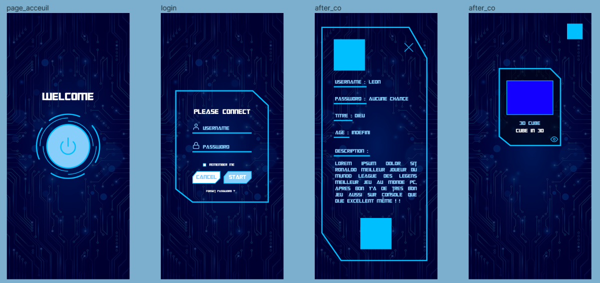

## README DES PROJETS REACT NATIVE

--------------------------

# React_Native_Project_1

--------------------------

## BUT

Le but de se projet est de faire une **"Application mobile"** sur `Android` pour acceder à une galerie d'art d'objets réalisés en 3D via `Blender`.

--------------------------

### Pour le 19 Décembre 2022

Il y aura de disponible :
- Un *FIGMA* pour le design de l'application 
- Une *PAGE HOME* qui Navigue vers la *PAGE LOGIN* 
- Une *PAGE LOGIN* qui une fois login enmmène dans la galerie 
- Une *PAGE GALERIE* qui contiendra les cartes des différents objets 
- La *NAVIGATION* entre les différents Pages. 
- Un *LOADER* entre la *PAGE HOME* et *LOGIN*
- Un *RETOUR UTILISATEUR SUR SES ACTIONS* grâce au Flash Message

### Pour le 9 Janvier 2023

Il y aura en plus :
- La *FINALISATION des tâches du 19 si elles sont pas finis*  
- La *FINALISATION du SITE* avec l'ajouts des cartes et des vidéos 3D

### Pour le rendu Finale du code fin Janvier 2023

Il y aura en plus :
- L'ajout de *Notifications push*  
- Un *meilleur Readme*
- Un *Code propre*

--------------------------

### Pour lancer le projet

Pour lancer le projet c'est très simple :

Il vous suffit d'abord de le cloner :
```
git clone lien_du_projet
```

Puis d'installer les dependencies :
```
npm i
```

Puis de lancer l'application et l'émulation :
```
1er Terminal :
npx react-native start
Vous pouvez aussi rajouter --reset-cache derrière pour éviter des erreurs

2e Terminal :
 npx react-native run-android
```

--------------------------

### Pour réaliser l'application

Voici les différentes technologies utilisées pour la réalisation de ce projet :
* [FIGMA] pour les logo / img
* [React-native/navigation] pour la navigation
* [Animated] pour les animations
* [PanResponder] pour le logout
* [Blender] pour la 3D
* [styled-components]  pour le style
* [react-native-video] pour les vidéos
* [react-native-flash-message] pour les flash-message
* [react-native-community/checkbox] pour la checkbox
* [ActivityIndicator] pour le loader

### Image du FIGMA



--------------------------

### REALISATION

Projet réalisé par :

> TheLeon9

Merci :smiley: !